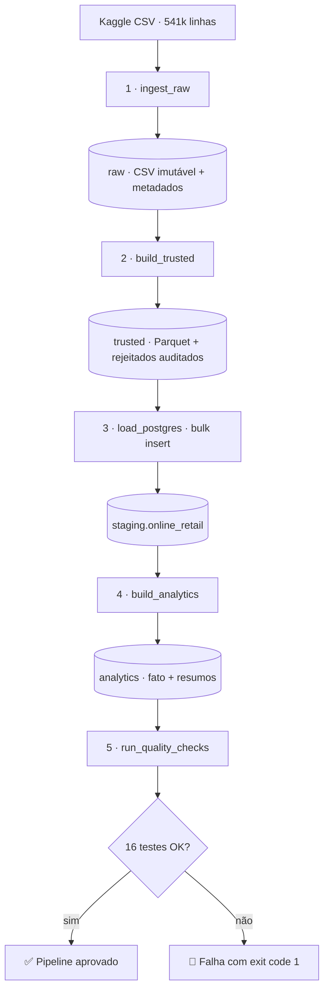

# 🛒 Retail Data Pipeline

> Pipeline **end-to-end de Engenharia de Dados** que ingere, transforma, modela e valida **~541 mil transações reais de varejo** — orquestrado com Apache Airflow e 100% containerizado com Docker.


---

## 🎯 Visão geral

O projeto simula um cenário real de engenharia de dados: um CSV "cru" e cheio de imperfeições (cancelamentos, devoluções, campos ausentes) é processado em **camadas sucessivas**, cada uma com um contrato claro de qualidade, até virar um **modelo dimensional confiável** no PostgreSQL.



---

## 🔄 O pipeline, passo a passo

### 1️⃣ Ingestão bruta — `ingest_raw`
Captura o CSV original e o trata como **fonte imutável**: valida o schema esperado, calcula hash SHA-256 e registra metadados (linhas, colunas, timestamp). Reingestões do mesmo arquivo são puladas automaticamente.
📦 *Saída:* `data/raw/online_retail.csv` + metadados.

### 2️⃣ Camada trusted — `build_trusted`
Aplica a primeira transformação confiável: normaliza nomes (`snake_case`), limpa textos, converte tipos (`Int64`, `Float64`, timestamps), cria colunas derivadas (`line_total`, `is_cancellation`) e **separa registros inválidos para auditoria** em vez de descartá-los em silêncio.
📦 *Saída:* Parquet confiável + Parquet de rejeitados + relatório da execução.

### 3️⃣ Carga no PostgreSQL — `load_postgres`
Carrega o Parquet no schema `staging` com **bulk insert nativo** (`psycopg2.extras.execute_values`), marcando cada execução com um `batch_id`. A carga é idempotente: trunca e recarrega, sem duplicidade.
📦 *Saída:* `staging.online_retail` (541.909 linhas).

### 4️⃣ Camada analytics — `build_analytics`
Constrói o **modelo dimensional** de consumo:
- **`fact_sales`** — fato de vendas com atributos de tempo (ano/mês/dia);
- **`product_sales_summary`** — receita, quantidade e invoices por produto;
- **`customer_sales_summary`** — pedidos, receita e primeira/última compra por cliente.

📦 *Saída:* schema `analytics` com índices e estatísticas atualizadas.

### 5️⃣ Qualidade de dados — `run_quality_checks`
Executa **16 testes SQL** (críticos e de aviso): nulos em campos obrigatórios, consistência `line_total = quantity × unit_price`, integridade entre camadas, unicidade de chaves e detecção de anomalias. Gera relatório JSON e **quebra o pipeline** em falhas críticas.
📦 *Saída:* `data/quality_checks/quality_checks_report.json`.

---

## 🗄️ Camadas de dados

| Camada | Onde | Garantia |
|---|---|---|
| **raw** | `data/raw/` | Imutável, com hash e metadados |
| **trusted** | `data/trusted/` (Parquet) | Tipada, padronizada, rejeitos auditados |
| **staging** | Postgres · `staging` | Carga idempotente com batch |
| **analytics** | Postgres · `analytics` | Modelo dimensional pronto p/ consumo |

---

## ⚙️ Orquestração & infraestrutura

- **Apache Airflow:** as 5 etapas rodam como tasks de uma DAG, com dependências, retries e logs centralizados na UI.
- **Docker Compose:** PostgreSQL + Airflow (webserver, scheduler, triggerer) + aplicação, reproduzíveis em qualquer máquina.
- **Orquestrador local:** `src/run_pipeline.py` permite rodar o pipeline completo (ou parcial) via CLI, sem Airflow.

## 🧰 Stack

`Python` · `pandas` · `pyarrow` · `PostgreSQL` · `psycopg2` · `SQLAlchemy` · `Apache Airflow` · `Docker Compose` · `Git`

## 📁 Estrutura

```
retail-data-pipeline/
├── dags/
│   └── retail_pipeline_dag.py   # DAG do Airflow (5 tasks)
├── src/
│   ├── ingest_raw.py            # 1 · ingestão bruta
│   ├── build_trusted.py         # 2 · camada trusted
│   ├── load_postgres.py         # 3 · carga staging
│   ├── build_analytics.py       # 4 · modelagem
│   ├── run_quality_checks.py    # 5 · qualidade
│   └── run_pipeline.py          # orquestrador CLI
├── data/                        # dados (não versionado)
├── Dockerfile                   # imagem da aplicação
├── Dockerfile.airflow           # imagem custom do Airflow
├── docker-compose.yml           # infra completa
└── .env.example                 # template de configuração
```

## ⭐ Destaques de engenharia

- **Idempotência** por hash SHA-256 e `TRUNCATE ... RESTART IDENTITY`;
- **Escrita atômica** de arquivos (`.tmp` → rename), sem artefatos corrompidos;
- **Bulk insert** otimizado: carga de 541k linhas em segundos;
- **Quality gate** com exit code — pronto para CI/CD;
- **Segredos fora do código** via `.env` (nunca versionado);
- **Rejeitos auditáveis** em vez de descarte silencioso.

